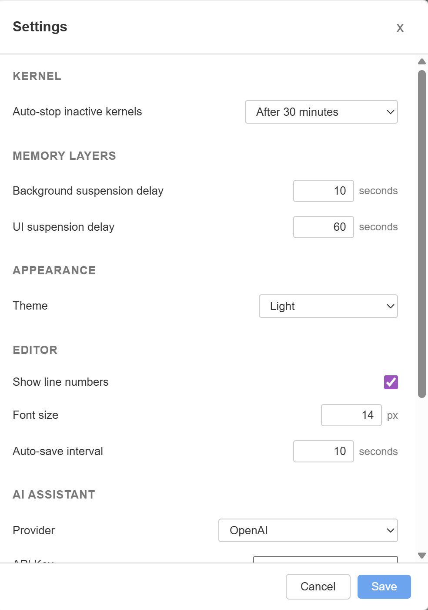

# Saturn

**Your notebooks are using 10x more RAM than your data. You just can't see it.**

Saturn is a lightweight desktop Jupyter notebook with built-in memory visibility. Same `.ipynb` files, same kernels, but now you can see exactly where your RAM goes.

`28 MB idle` | `3.3s cold start` | `16 MB install` | `2-4x lighter than JupyterLab Desktop`

---

<!-- PRIMARY HERO GIF: the "memory reveal" moment -->
<!-- Open notebook -> run cell -> per-cell delta appears -> open inspector -> show large vars -> clear one -->


---

## The problem

You run a notebook. The kernel crashes. You have no idea why.

- Which cell allocated the most RAM?
- Which variables are taking up gigabytes?
- Is the kernel bloated from outputs, or from your data?

Jupyter doesn't tell you. Saturn does.

## What Saturn does

Saturn tracks memory at every level of your notebook workflow:

- **Per-cell RAM deltas** shown after each execution, so you know exactly which cell costs what
- **Variable inspector** with deep sizing for DataFrames, arrays, and tensors, sorted by actual memory footprint
- **Output size tracking** so you can find and strip bloated outputs before saving
- **Lightweight desktop app** that uses 28 MB idle instead of 500 MB+ for a browser tab plus a Python server

---

## Feature demos

### Feature tour

<!-- open notebook, run cells, dark/light toggle, variable inspector, terminal -->


### Per-cell memory tracking

<!-- run small + large cell, show different deltas -->


### Variable inspector

<!-- sort by size, inspect, delete a variable -->


### Output tracking

<!-- large outputs, output accounting, strip outputs -->


---

## Saturn vs Jupyter

| Feature | Saturn | Jupyter |
|---------|--------|---------|
| Per-cell RAM usage | Yes | No |
| Variable memory inspector | Built-in, deep sizing | Basic (no sizes) |
| Output size tracking | Yes | No |
| Save without outputs | One click | Manual |
| Stale cell indicators | Yes | No |
| Execution order warnings | Yes | No |
| Lightweight desktop app | 28 MB | 500 MB+ |
| Interactive widgets (anywidget) | Yes | Yes |
| AI code assistance | Built-in | Extension |

Saturn is not trying to replace the Jupyter ecosystem. It reads and writes standard `.ipynb` files and uses standard Jupyter kernels. It's a different frontend focused on memory visibility and lightweight local workflows.

---

## Benchmarks

Measured on Windows x64, 16 GB RAM. Saturn includes everything (WebView, UI, Rust backend). JupyterLab numbers exclude the browser tab, which adds 200-400 MB.

| Metric | Saturn | JupyterLab Desktop | Difference |
|--------|--------|-------------------|------------|
| Install size | 16.7 MB | 35.7 MB | 2.1x smaller |
| Cold start | 3.3s | 8.0s | 2.4x faster |
| Idle RAM | 28 MB | 117 MB + browser | 4-18x less |

---

## Side-by-side comparisons

### Cold start

<!-- Saturn and JupyterLab Desktop launching simultaneously -->


### Memory visibility

<!-- Same notebook, same cell. Saturn shows RAM info. Jupyter doesn't. -->


---

## Screenshots

<table>
<tr>
<td></td>
<td></td>
</tr>
<tr>
<td></td>
<td></td>
</tr>
<tr>
<td></td>
<td></td>
</tr>
<tr>
<td></td>
<td></td>
</tr>
</table>

---

## Features

### Memory

- Per-cell RAM tracking with deltas after every execution
- Variable inspector with deep sizing (pandas, numpy, pytorch)
- Duplicate object detection
- Output size accounting
- Save-without-outputs workflow
- Memory snapshots and diff

### Performance

- 28 MB idle RAM (no browser needed)
- 3.3s cold start
- Virtual scrolling for large notebooks
- Lazy image and output loading
- Tab suspension layers (background, UI unmount, kernel auto-stop)

### Notebook

- Multi-tab notebooks
- Dark mode
- Integrated terminal
- anywidget interactive widgets
- Stale cell indicators
- Execution order warnings
- Drag-and-drop cell reordering
- Collapsible headings
- Search and replace
- Command palette (Ctrl+Shift+P)
- Kernel-powered autocomplete and tooltips
- Export to .py and HTML

### AI

- Explain cell (natural language explanation)
- Fix error (sends code + traceback, returns corrected code)
- Multiple providers: OpenAI, Anthropic, Ollama (local), custom endpoints

---

## Installation

### Download

Download the latest installer from [Releases](https://github.com/YOUR_USERNAME/saturn/releases):

- **Windows**: `Saturn_x.x.x_x64-setup.exe` (NSIS) or `.msi`
- **macOS**: `.dmg` (Apple Silicon and Intel)
- **Linux**: `.AppImage` or `.deb`

### Requirements

Saturn needs a Jupyter kernel installed on your system. If you have Python with `ipykernel`:

```bash
pip install ipykernel
```

### Build from source

```bash
git clone https://github.com/YOUR_USERNAME/saturn.git
cd saturn
npm install
npm run tauri dev      # development
npm run tauri build    # production build
```

Requires: Node.js 18+, Rust 1.70+, platform dependencies for Tauri v2 ([see Tauri docs](https://v2.tauri.app/start/prerequisites/)).

---

## Why Saturn exists

Notebooks are great for exploration, but they're terrible at telling you what's happening under the hood. You write a cell, run it, and the kernel silently allocates hundreds of megabytes. The only signal you get is when the kernel crashes.

Saturn was built because memory problems in notebooks shouldn't require guesswork. Every cell shows its cost. Every variable shows its footprint. Every output shows its weight. You stay in control of your resources instead of discovering problems after the fact.

---

## Architecture

Saturn is built on [Tauri v2](https://v2.tauri.app/), which means a Rust backend with an OS-native WebView instead of bundling Chromium like Electron does. This is why Saturn can be 16 MB instead of 150 MB+.

- **Rust backend**: ZeroMQ kernel protocol, process memory monitoring (sysinfo), filesystem operations, PTY terminal
- **React frontend**: TypeScript, CodeMirror 6, Zustand state management
- **Kernel communication**: Pure Rust ZMQ (no C bindings), same 5-channel wire protocol as Jupyter
- **Output isolation**: All rich HTML runs in sandboxed iframes. Widget ESM executes in a separate sandbox via postMessage bridge.

---

## Contributing

Issues and pull requests are welcome. Please open an issue first for large changes so we can discuss the approach.

```bash
npm run tauri dev     # start dev server
npx tsc --noEmit      # type check
npx vitest run        # run tests
cargo test --manifest-path src-tauri/Cargo.toml  # rust tests
```

---

## Roadmap

- [ ] Remote kernel support (JupyterHub / Jupyter Server)
- [ ] Plugin / extension API
- [ ] Real-time collaboration
- [ ] Virtual scrolling with react-window for 1000+ cell notebooks

---

## License

[MIT](LICENSE)
