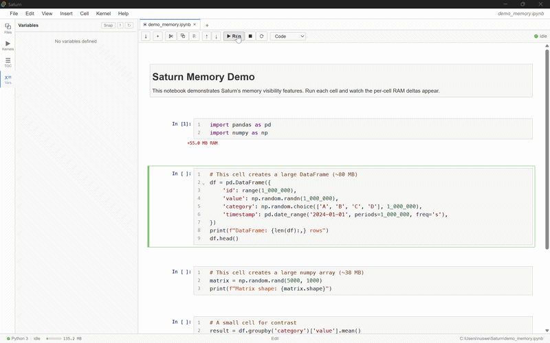
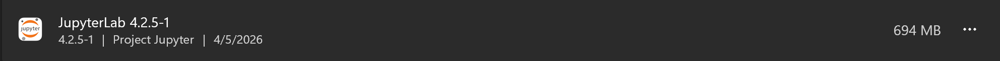
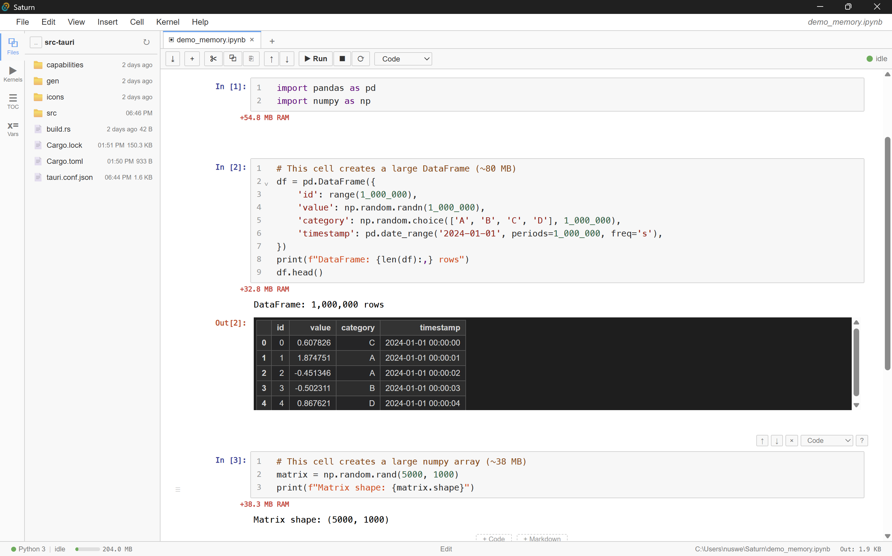
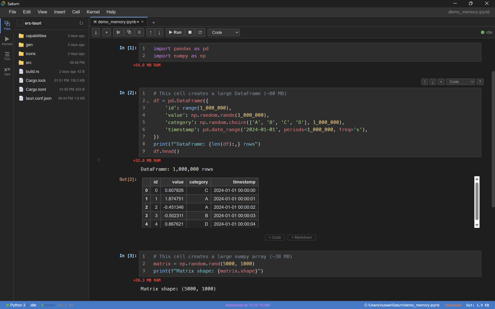
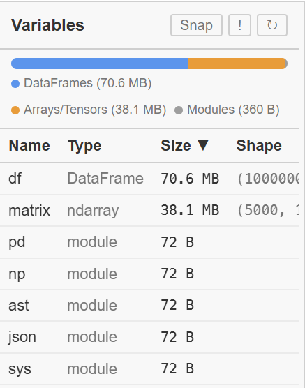
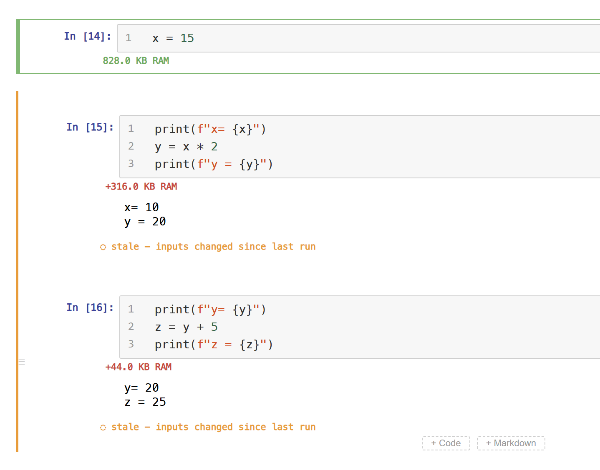
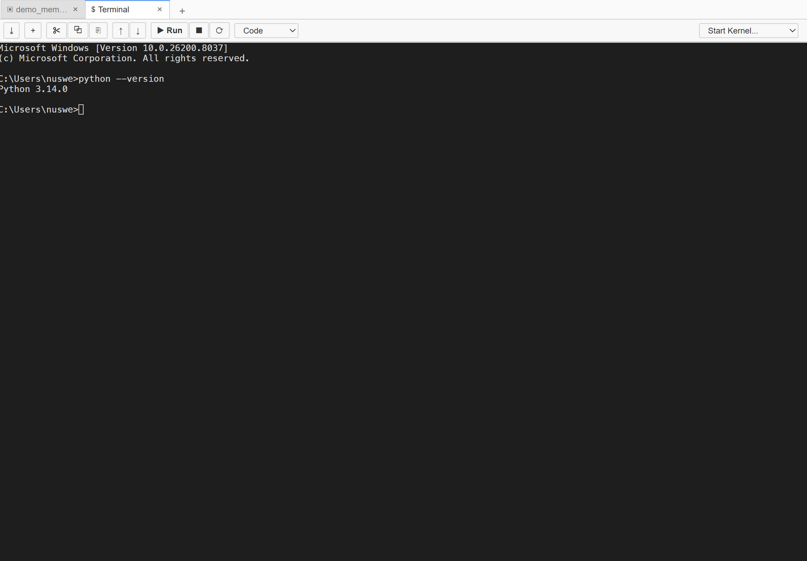
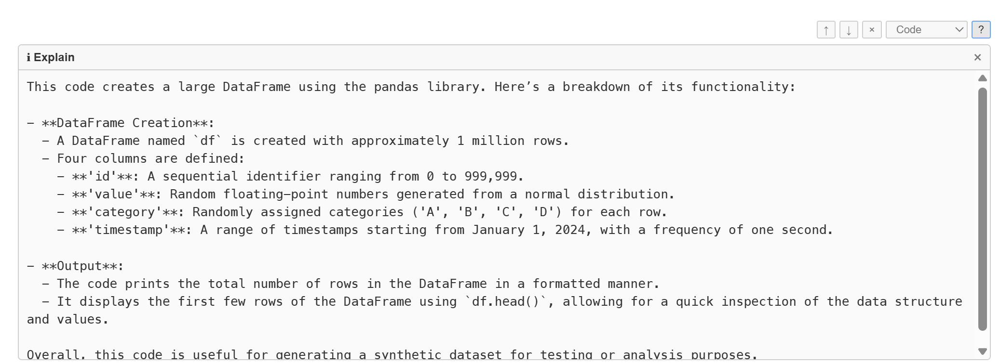

# Saturn

**A Jupyter notebook frontend with built-in memory visibility.**

Saturn is a lightweight desktop notebook application designed for standard `.ipynb` files and existing Jupyter kernels. It makes memory usage visible at the cell, variable, and output level while maintaining the notebook workflow users already know. The full application occupies roughly 17 MB on disk rather than hundreds of megabytes.

`180 MB idle` | `~4s startup` | `5 MB installer` | `17 MB on disk`

---



---

## Why Saturn exists

Notebook workflows make it easy to execute code without understanding its resource cost. When a kernel becomes unstable or crashes, it is often difficult to determine which cell caused the spike, which variables are retaining memory, or whether notebook outputs have become unnecessarily large.

Saturn addresses this directly. Each cell displays its memory delta after execution. The variable inspector reports object sizes with deep sizing for DataFrames, arrays, and tensors. Output accounting shows which cells are responsible for notebook bloat before the file is saved. All of this is provided in a native desktop application with lower overhead than an Electron-based or browser-based workflow.

---

## Memory tracking


After each cell runs, Saturn displays the corresponding memory delta immediately. Small operations remain clearly distinguishable from large allocations, making it possible to identify the precise steps responsible for increased memory usage.

The variable inspector sorts objects by size and supports deep introspection for pandas, NumPy, and PyTorch objects. Large allocations can be identified quickly, inspected directly, and cleared when no longer needed.

---

## Feature tour


Saturn includes the core workflow expected from a notebook environment: multi-tab notebooks, dark mode, an integrated terminal, a command palette, drag-and-drop cell reordering, collapsible headings, and kernel-powered autocomplete. The goal is to preserve the notebook experience while reducing unnecessary overhead and exposing information that standard notebook interfaces do not surface.

---

## Comparison

### Size

| | Saturn | JupyterLab Desktop |
|---|--------|-------------------|
| Installer | 5 MB | 500 MB |
| On disk | 17 MB | 694 MB |

<table>
<tr>
<td></td>
<td></td>
</tr>
</table>

### Startup

| | Saturn | JupyterLab Desktop |
|---|--------|-------------------|
| Cold start | ~4 seconds | ~14 seconds |

<table>
<tr>
<td>
<strong>Saturn</strong><br>

</td>
<td>
<strong>JupyterLab Desktop</strong><br>

</td>
</tr>
</table>

### Memory

Measured on Windows x64, 16 GB RAM, using the same notebook (`demo_memory.ipynb`) for both apps. Memory was read from Task Manager's Details tab. The Python kernel process (`python.exe`) is excluded from both apps since it is the same kernel regardless of frontend. Only the application's own processes are counted: `saturn.exe` + `msedgewebview2.exe` for Saturn, `jlab.exe` + sub-processes for JupyterLab Desktop.

| Step | Saturn | JupyterLab Desktop |
|------|--------|-------------------|
| Idle (no notebook) | 180 MB | 234 MB |
| Notebook open + kernel started | 226 MB | 433 MB |
| After running all cells | 238 MB | 443 MB |

The kernel process itself used ~166 MB in Saturn and ~169 MB in JupyterLab Desktop, confirming that the kernel overhead is equivalent. The difference is entirely in the frontend application.

**Note on browser-based JupyterLab:** The numbers above are for JupyterLab Desktop, which is an Electron application bundling Chromium. The browser-based version of JupyterLab (`jupyter lab` opened in Chrome or Firefox) splits its cost differently: a Python server process (~117 MB) plus a browser tab (200-400 MB depending on the browser and notebook size). The total is comparable to Desktop but spread across separate processes.

### Features

| | Saturn | Jupyter |
|---|--------|---------|
| Per-cell RAM tracking | Yes | No |
| Variable memory inspector | Built-in, deep sizing | Basic, no sizes |
| Output size tracking | Yes | No |
| Save without outputs | One click | Manual |
| Stale cell indicators | Yes | No |
| Execution order warnings | Yes | No |
| Interactive widgets | Yes (anywidget) | Yes |
| AI code assistance | Built-in | Extension |

Saturn reads and writes standard `.ipynb` files and uses standard Jupyter kernels. It is not intended to replace the broader Jupyter ecosystem. Instead, it provides an alternative frontend for users who want better visibility into notebook behavior and lower local overhead.

---

## Screenshots

<table>
<tr>
<td></td>
<td></td>
</tr>
<tr>
<td></td>
<td></td>
</tr>
<tr>
<td></td>
<td></td>
</tr>
</table>

---

## Included functionality

### Memory tools
- Per-cell RAM deltas after execution
- Variable inspector with deep sizing
- Duplicate object detection
- Output size accounting
- Save-without-outputs workflow
- Memory snapshots and diffs

### Notebook features
- Multi-tab notebooks
- Dark mode
- Integrated terminal
- Text editor
- anywidget support
- Stale cell indicators
- Execution order warnings
- Drag-and-drop cell reordering
- Collapsible headings
- Search and replace
- Command palette
- Kernel-powered autocomplete and tooltips
- Export to `.py` and HTML

### AI assistance
- Explain cell
- Fix error
- Support for OpenAI, Anthropic, and local Ollama models

### Performance
- 180 MB idle (vs 234-443 MB for JupyterLab Desktop)
- ~4 second startup
- CSS-based virtual scrolling
- Lazy output loading
- Three-tier tab suspension

---

## Installation

Download the latest installer from [Releases](https://github.com/YOUR_USERNAME/saturn/releases):

- **Windows**: `Saturn_0.1.0_x64-setup.exe` or `.msi`
- **macOS**: `.dmg` (Apple Silicon and Intel)
- **Linux**: `.AppImage` or `.deb`

A Jupyter kernel must already be installed. For Python environments:

```bash
pip install ipykernel
```

### Build from source

```bash
git clone https://github.com/YOUR_USERNAME/saturn.git
cd saturn
npm install
npm run tauri dev      # development
npm run tauri build    # production
```

Requires Node.js 18+, Rust 1.70+, and [Tauri v2 prerequisites](https://v2.tauri.app/start/prerequisites/).

---

## Architecture

Saturn is built on [Tauri v2](https://v2.tauri.app/), which provides a Rust backend with the OS-native WebView rather than bundling Chromium as Electron does. This is the primary reason the application is 17 MB rather than several hundred.

The backend handles kernel communication using pure Rust ZeroMQ (no C bindings), process memory monitoring, filesystem operations, and PTY terminal management. The frontend uses React with TypeScript, CodeMirror 6, and Zustand for state management. All rich output and widget code executes in sandboxed iframes with no access to the host application.

---

## Contributing

Issues and pull requests are welcome. For larger changes, please open an issue first to discuss the approach.

```bash
npm run tauri dev                              # dev server
npx tsc --noEmit                               # type check
npx vitest run                                 # frontend tests
cargo test --manifest-path src-tauri/Cargo.toml # rust tests
```

---

## Roadmap

- [ ] Plugin / extension API
- [ ] Real-time collaboration

---

## License

[Apache 2.0](LICENSE)
